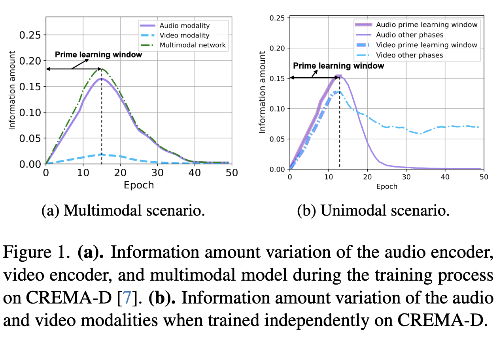
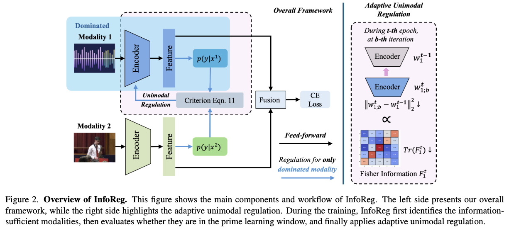

# Code of InfoReg
This is the official PyTorch implementation of "Adaptive Unimodal Regulation for Balanced Multimodal Information Acquisition".

## Paper title:
**Adaptive Unimodal Regulation for Balanced Multimodal Information Acquisition** [**[arXiv](https://arxiv.org/abs/2503.18595)**]

## Authors:
**Chengxiang Huang†**, **[Yake Wei](https://echo0409.github.io/)†**, **Zequn Yang** and **[Di Hu](https://dtaoo.github.io/index.html)**

## Abstract:
Sensory training during the early ages is vital for human development. Inspired by this cognitive phenomenon, we observe that the early training stage is also important for the multimodal learning process, where dataset information is rapidly acquired. We refer to this stage as the prime learning window. However, based on our observation, this prime learning window in multimodal learning is often dominated by information-sufficient modalities, which in turn suppresses the information acquisition of information-insufficient modalities.
To address this issue, we propose **Info**rmation Acquisition **Reg**ulation (InfoReg), a method designed to balance information acquisition among modalities. Specifically, InfoReg slows down the information acquisition process of information-sufficient modalities during the prime learning window, which could promote information acquisition of information-insufficient modalities. This regulation enables a more balanced learning process and improves the overall performance of the multimodal network. Experiments show that InfoReg outperforms related multimodal imbalanced methods across various datasets, achieving superior model performance.

For more details of our paper, please refer to  our [CVPR 2025 paper](https://arxiv.org/abs/2503.18595).

## Imbalanced information acquisition in multimodal learning during the prime learning window

    
    

As shown in Figure 1(a), the green curve, representing the overall multimodal network, demonstrates a rapid increase in information amount during the prime learning window. For audio modality, its overall trend closely aligns with the overall multimodal model, and shows a high information acquisition amount during the prime learning window. These findings align with our expectation that modality information could be acquired effectively within the prime learning window.
However, the video modality, represented by the blue curve, shows a much lower information acquisition amount during the prime learning window. Although the video modality is capable of effective information acquisition in the unimodal scenario in Figure 2(b), it fails to do so in the multimodal scenario when trained jointly with the audio modality. 
These observations suggest that information-insufficient modalities, like video, experience suppressed information acquisition during the prime learning window due to the stronger information acquisition capacity of information-sufficient modalities, such as audio.

For multimodal learning, information acquisition during the prime learning window is crucial. Based on this, we propose InfoReg, which mitigates imbalanced information acquisition by regulating the information acquisition of information-sufficient modalities during the prime learning window.

## Overview of InfoReg

    
    

## Dataset 

The original datasets can be found:
[CREMA-D](https://github.com/CheyneyComputerScience/CREMA-D),
[Kinetics-Sounds](https://github.com/cvdfoundation/kinetics-dataset),
[CMU-MOSI](http://multicomp.cs.cmu.edu/resources/cmu-mosi-dataset/)

Data processing follows [OGM](https://github.com/GeWu-Lab/OGM-GE_CVPR2022).

## Run the code
After data processing, you can simply run the code by:
<pre><code>
python main.py
</code></pre>

## Citation
If you find this work useful, please consider citing it.

<pre><code>
@article{huang2025adaptive,
  title={Adaptive Unimodal Regulation for Balanced Multimodal Information Acquisition},
  author={Huang, Chengxiang and Wei, Yake and Yang, Zequn and Hu, Di},
  journal={arXiv preprint arXiv:2503.18595},
  year={2025}
}
</code></pre>

